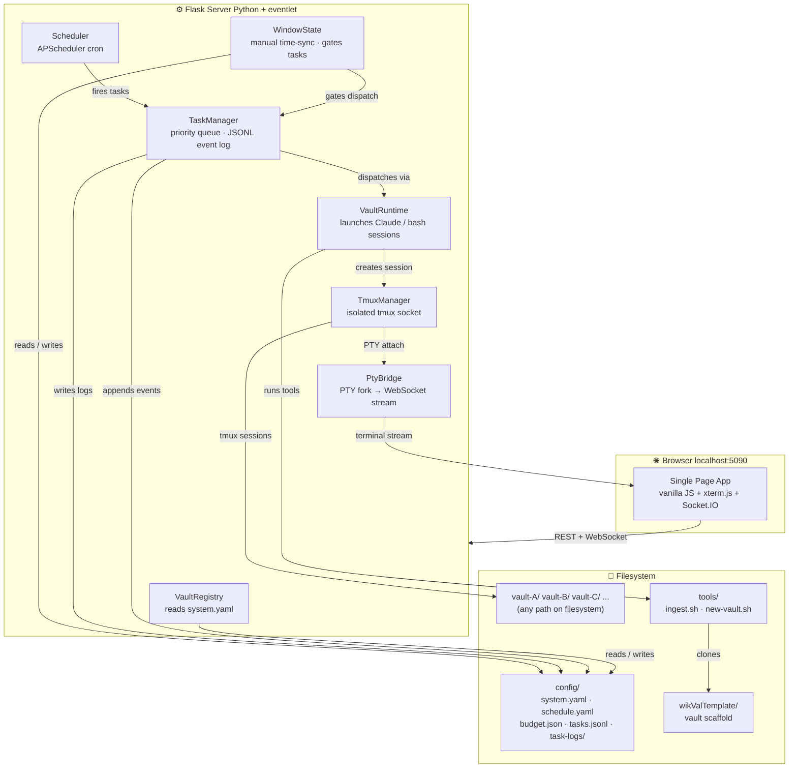
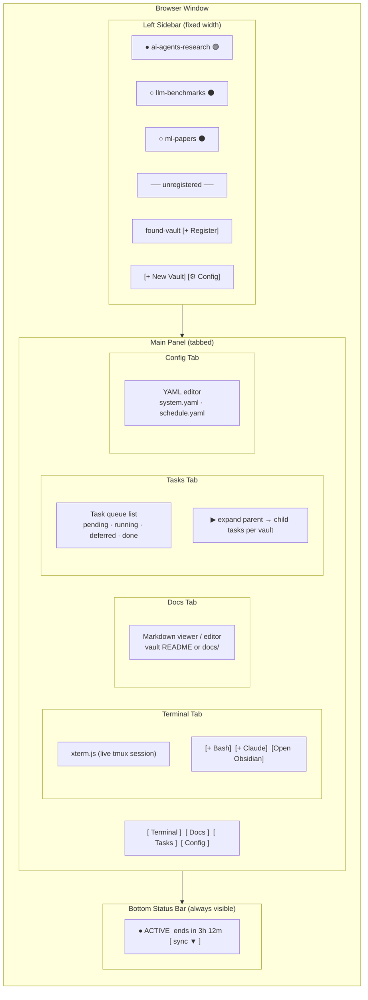
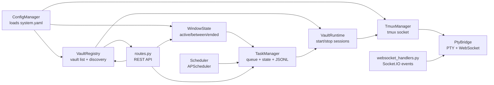
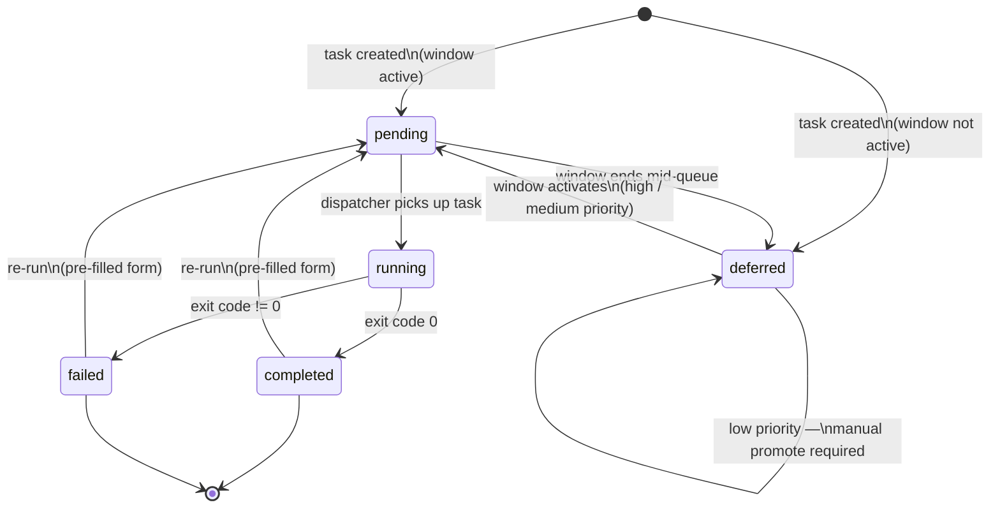
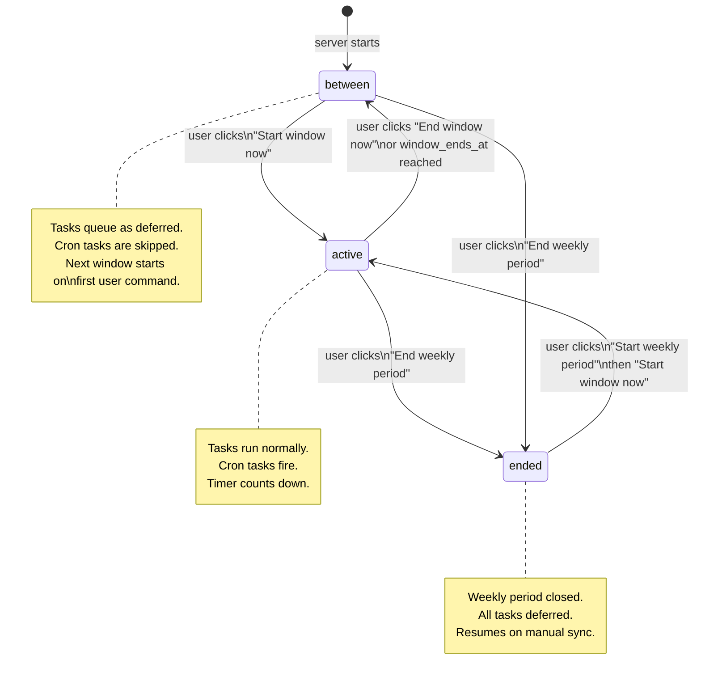
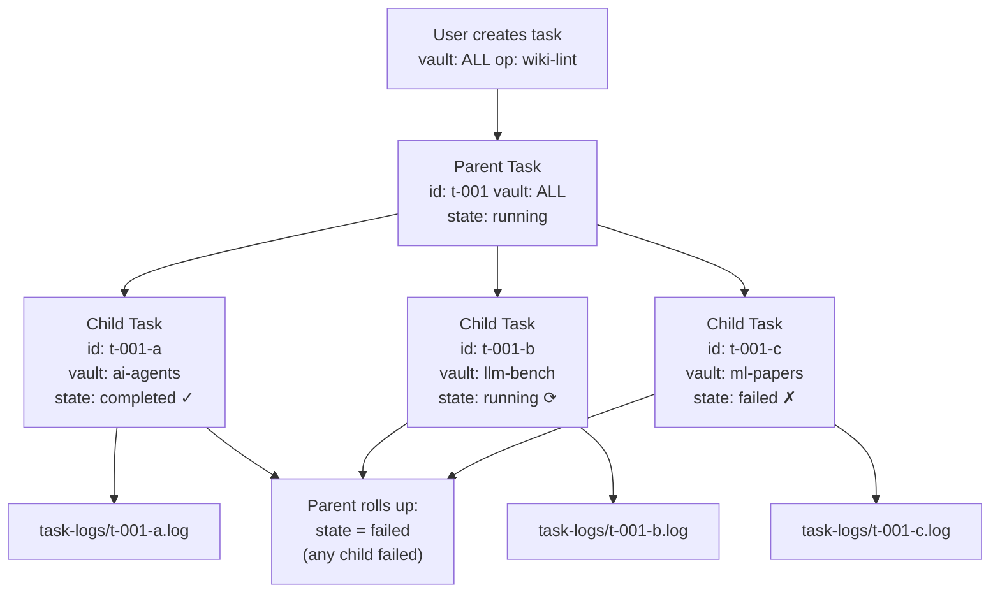
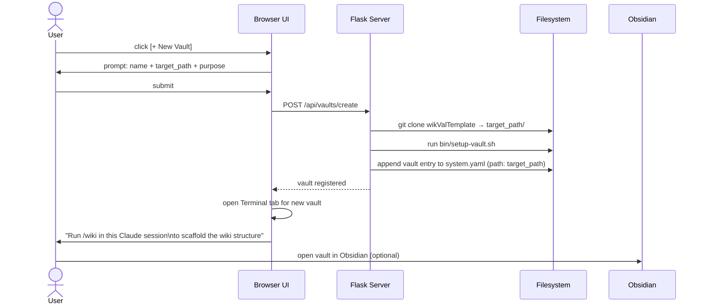
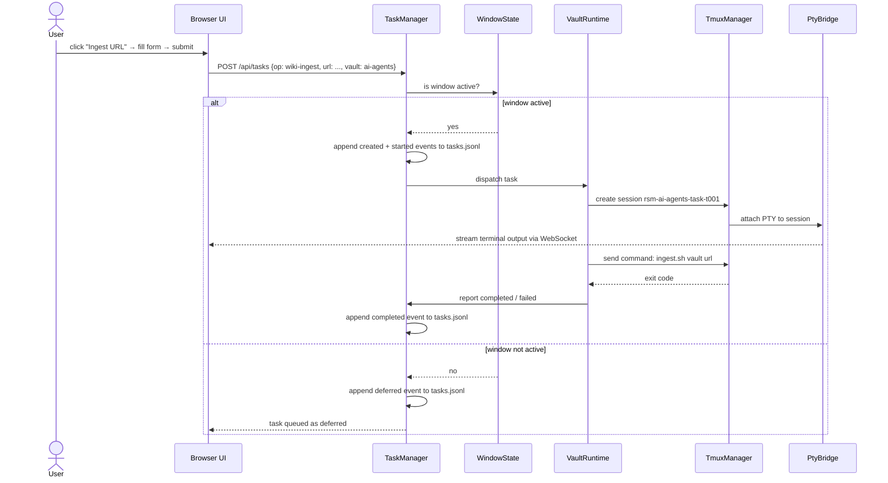

# resman — Mermaid Architecture Diagrams

---

## 1. System Layers Overview

---

## 2. Browser UI Layout

---

## 3. Server Module Dependencies

---

## 4. Task State Machine

---

## 5. Window State Machine

---

## 6. ALL-Vaults Task Fan-Out

---

## 7. New Vault Creation Flow

---

## 8. Vault Operation Execution Flow

